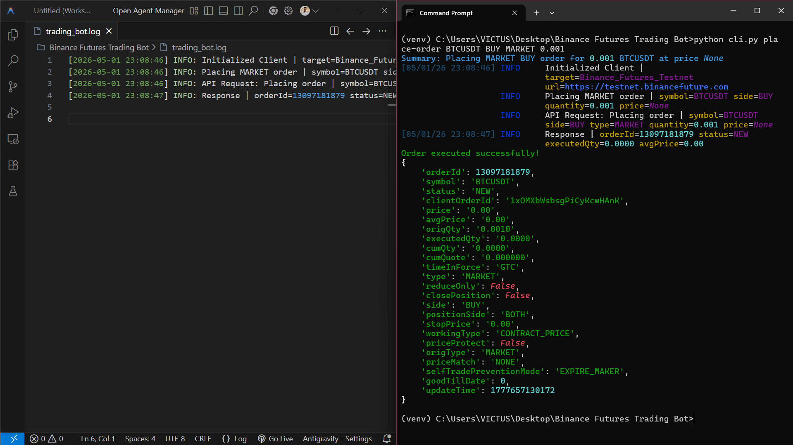
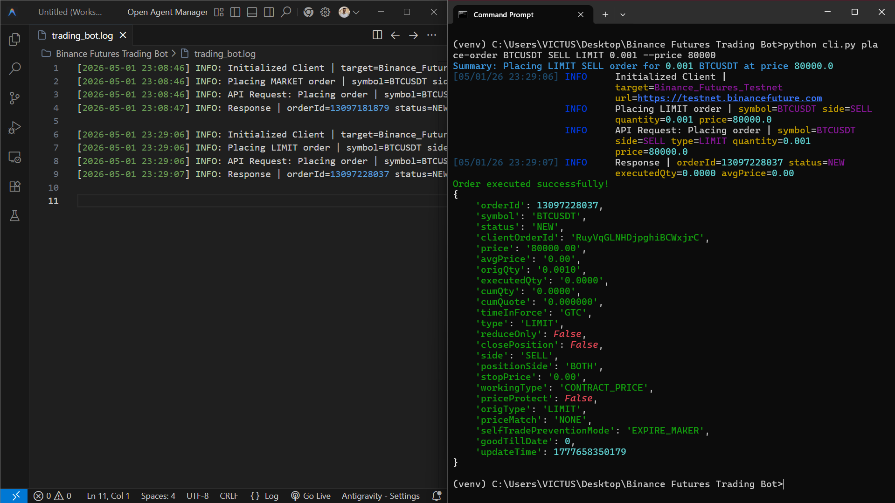
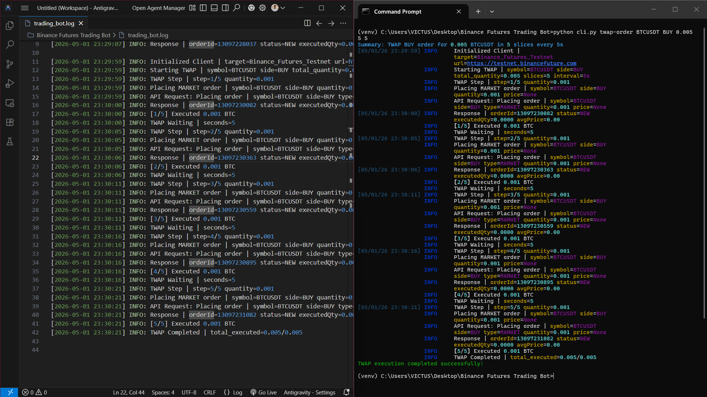
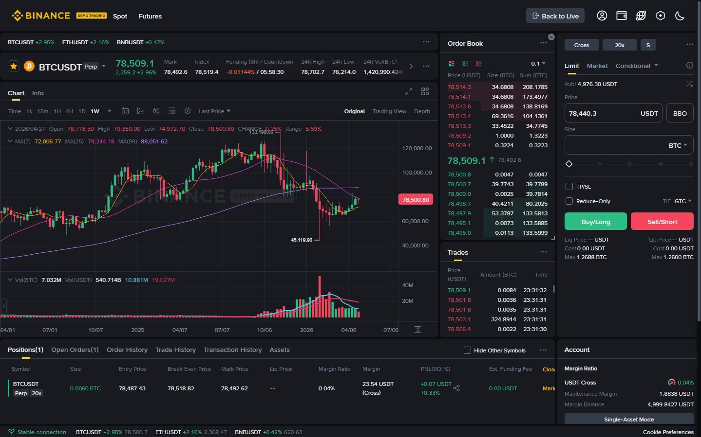
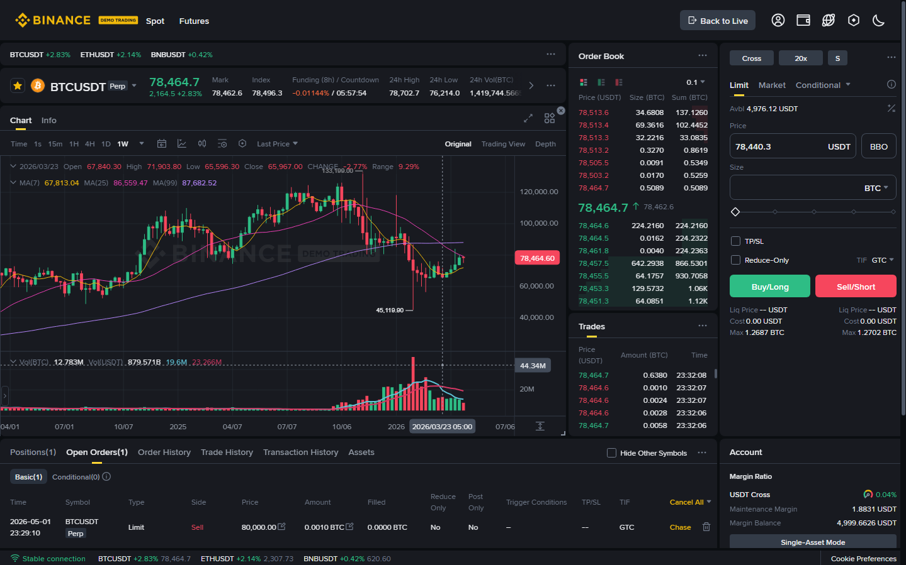
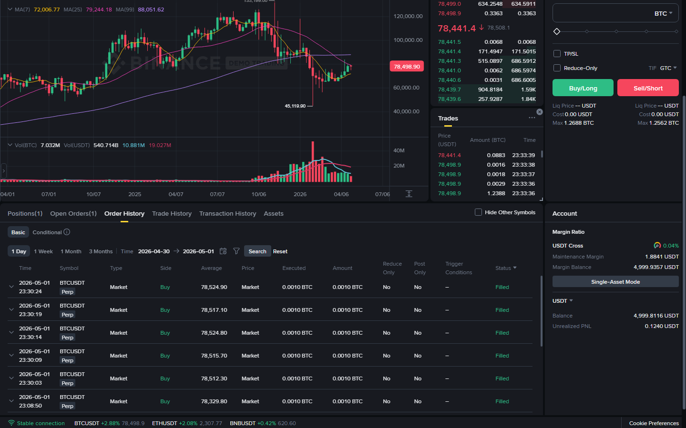

# Binance Futures Testnet Trading Bot

A production-quality Python CLI application for a Binance Futures Testnet trading bot.

## Project Overview

This project provides a simple, robust command-line interface to interact with the Binance Futures Testnet. It supports placing MARKET and LIMIT orders, and includes a TWAP (Time Weighted Average Price) execution strategy.

## Design Decisions

- **Library**: `python-binance` is used because it is a stable, widely-supported library that handles authentication, request signing, and provides a pythonic interface to Binance's API.
- **Architecture**: The project follows clean architecture principles. Core components are decoupled:
  - `client.py`: Handles API interaction exclusively.
  - `orders.py`: Contains the execution logic (single orders, TWAP) agnostic of CLI.
  - `validators.py`: Centralized input validation.
  - `cli.py`: The presentation layer using `Typer` for a clean CLI experience.
- **TWAP Purpose**: The TWAP implementation allows splitting a large order into smaller slices executed over time, helping to minimize market impact or manage slippage. It uses a synchronous loop with `time.sleep` for simplicity and reliability.
- **Logging**: Structured logging is implemented via the standard `logging` library. Actions, parameters, and errors are formatted as key-value pairs (e.g., `Action | key=value`), saving to `trading_bot.log` for audibility while `rich` handles nice colored output in the terminal.

## Features

- **Order Execution**: Place MARKET and LIMIT orders on the Futures Testnet.
- **TWAP Execution**: Split large orders into smaller chunks over a defined interval.
- **Robust Validation**: Strict input validation before API calls.
- **Error Handling**: Graceful handling of Binance API exceptions and network errors.
- **Structured Logging**: Consistent, informative file-based logging.

## Project Structure

```text
binance_futures_trading_bot/
│
├── trading_bot/
│   ├── __init__.py
│   ├── bot/
│   │   ├── __init__.py
│   │   ├── client.py         # Binance API wrapper
│   │   ├── config.py         # Environment configuration
│   │   ├── logger.py         # Structured logging setup
│   │   ├── orders.py         # Market, Limit, and TWAP execution logic
│   │   └── validators.py     # Input validation rules
│   └── tests/
│       ├── __init__.py
│       └── test_validators.py # Unit tests for input validation
│
├── images/                   # Screenshots for documentation
├── .env                      # Local environment variables (ignored in git)
├── .env.example              # Template for environment variables
├── .gitignore                # Git ignored files
├── cli.py                    # Typer CLI entry point
├── README.md                 # Project documentation
├── requirements.txt          # Python dependencies
└── trading_bot.log           # Application logs (generated during execution)
```

## Setup Instructions

1. Clone or download the repository.
2. Create a virtual environment and activate it:
   ```bash
   python -m venv venv
   source venv/bin/activate  # On Windows: venv\Scripts\activate
   ```
3. Install dependencies:
   ```bash
   pip install -r requirements.txt
   ```
4. Create your `.env` file from the example:
   ```bash
   cp .env.example .env
   ```

## Configuration

Edit the `.env` file and insert your Binance Testnet API credentials.

```env
API_KEY=your_testnet_api_key_here
API_SECRET=your_testnet_api_secret_here
BASE_URL=https://testnet.binancefuture.com
```

## How to Run

### Example 1: MARKET Order
```bash
python cli.py place-order BTCUSDT BUY MARKET 0.001
```

### Example 2: LIMIT Order
```bash
python cli.py place-order BTCUSDT SELL LIMIT 0.001 --price 60000
```

### Example 3: TWAP Order
Executes 0.01 BTC in 5 slices, waiting 10 seconds between each slice:
```bash
python cli.py twap-order BTCUSDT BUY 0.01 5 10
```

## Sample Output

**CLI Output (TWAP):**
```
Summary: TWAP BUY order for 0.01 BTCUSDT in 5 slices every 10s
[1/5] Executed 0.002 BTCUSDT
[2/5] Executed 0.002 BTCUSDT
...
TWAP execution completed successfully!
```

**Log Output (`trading_bot.log`):**
```
[2024-05-01 15:30:00] INFO: Initialized Client | target=Binance_Futures_Testnet url=https://testnet.binancefuture.com
[2024-05-01 15:30:00] INFO: Starting TWAP | symbol=BTCUSDT side=BUY total_quantity=0.01 slices=5 interval=10s
[2024-05-01 15:30:00] INFO: TWAP Step | step=1/5 quantity=0.002
[2024-05-01 15:30:00] INFO: API Request: Placing order | symbol=BTCUSDT side=BUY type=MARKET quantity=0.002 price=None
[2024-05-01 15:30:00] INFO: Response | orderId=12345 status=FILLED executedQty=0.002 avgPrice=60000.5
[2024-05-01 15:30:00] INFO: [1/5] Executed 0.002 BTC
[2024-05-01 15:30:00] INFO: TWAP Waiting | seconds=10
```

## Assumptions

- The bot targets the USDT-M Futures Testnet.
- Quantities provided adhere to Binance's lot size and precision requirements. The TWAP logic uses a generic 3-decimal rounding (0.001) which is common, but may fail if the asset requires different precision.
- The environment uses Python 3.8+

## Screenshots

### 1. Market Buy Execution


### 2. Limit Sell Execution


### 3. TWAP Buy Execution


### 4. Binance Dashboard - Open Positions


### 5. Binance Dashboard - Open Orders


### 6. Binance Dashboard - Order History



## Important Notes

- LIMIT orders must follow exchange constraints:
  - SELL LIMIT → price must be above current market price
  - BUY LIMIT → price must be below current market price
- Orders may appear under:
  - Positions (for executed MARKET orders)
  - Open Orders (for pending LIMIT orders)
  - Order History (for completed trades)